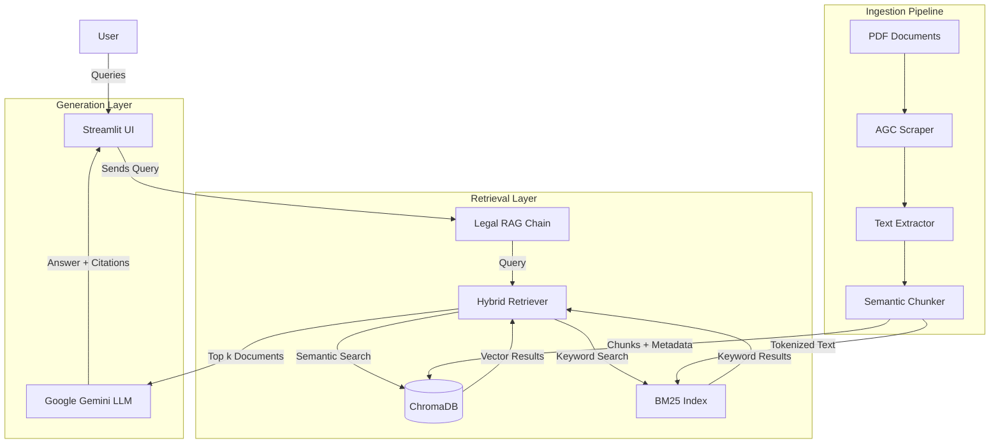

# Malaysian Legal RAG System

A Retrieval-Augmented Generation (RAG) pipeline for Malaysian statutory law. This system provides AI-powered legal question answering with citation support, built on ChromaDB for vector storage and Google Gemini for language generation.

## Overview

This project implements a complete RAG pipeline for querying Malaysian legal statutes. The system uses hybrid retrieval (combining semantic similarity and keyword matching) to find relevant legal provisions, then generates natural language answers with proper citations.

### Supported Legal Acts (MVP Scope)

| Act | Act Number | Year |
|-----|------------|------|
| Contracts Act | Act 136 | 1950 |
| Specific Relief Act | Act 137 | 1951 |
| Housing Development (Control and Licensing) Act | Act 118 | 1966 |

### Performance Metrics

Based on evaluation against a 20-question golden dataset:

| Metric | Score |
|--------|-------|
| Hit Rate @ 1 | 95.0% |
| Hit Rate @ 3 | 100.0% |
| Mean Reciprocal Rank (MRR) | 0.975 |

---

## Architecture

### System Components



### Technology Stack

| Component | Technology |
|-----------|------------|
| Language | Python 3.12+ |
| LLM Framework | LangChain |
| LLM Provider | Google Gemini 2.0 Flash Lite |
| Vector Database | ChromaDB (local persistence) |
| Embedding Model | sentence-transformers/all-MiniLM-L6-v2 |
| Keyword Search | BM25 (rank_bm25) |
| Web Interface | Streamlit |
| PDF Processing | pypdf |

---

## Project Structure

```
MyLaw-RAG/
├── data/
│   ├── raw/                    # Original PDF files from AGC
│   ├── processed/              # Extracted text and chunks (JSON)
│   └── vector_db/              # ChromaDB persistence directory
├── src/
│   ├── config.py               # Centralized configuration
│   ├── ingestion/
│   │   ├── agc_scraper.py      # Downloads PDFs from AGC website
│   │   ├── text_extractor.py   # PDF to text extraction with cleaning
│   │   ├── chunker.py          # Semantic chunking by legal sections
│   │   └── vector_ingest.py    # ChromaDB ingestion
│   ├── retrieval/
│   │   └── hybrid_retriever.py # BM25 + semantic search with RRF fusion
│   ├── generation/
│   │   ├── prompts.py          # System prompts and templates
│   │   └── rag_chain.py        # LangChain RAG pipeline
│   ├── evaluation/
│   │   └── evaluate_rag.py     # Retrieval evaluation metrics
│   └── app/
│       └── app.py              # Streamlit web application
├── tests/
│   ├── test_rag.py             # Unit tests
│   └── golden_dataset.json     # 20 test questions with ground truth
├── requirements.txt
├── .env.example
└── README.md
```

---

## Installation

### Prerequisites

- Python 3.10 or higher
- pip package manager
- Google API key for Gemini access

### Setup Steps

1. **Create and activate virtual environment**

   ```bash
   cd MyLaw-RAG
   python -m venv venv
   
   # Windows
   venv\Scripts\activate
   
   # Linux/macOS
   source venv/bin/activate
   ```

2. **Install dependencies**

   ```bash
   pip install -r requirements.txt
   ```

3. **Configure environment variables**

   Copy the example environment file and add your API key:

   ```bash
   cp .env.example .env
   ```

   Edit `.env` and set:

   ```
   GEMINI_API_KEY=your_api_key_here
   ```

   To obtain a Google API key, visit [Google AI Studio](https://aistudio.google.com/).

---

## Usage

### Running the Web Interface

```bash
streamlit run src/app/app.py
```

The application will be available at `http://localhost:8501`.

### Example Queries

- "What are the requirements for specific performance of a contract?"
- "When is a contract voidable due to coercion?"
- "What are the licensing requirements for housing developers?"

---

## Data Pipeline

The data ingestion pipeline consists of four stages. These only need to be run if rebuilding the database from scratch.

### Stage 1: PDF Download

Downloads legal act PDFs from the Attorney General's Chambers (AGC) website.

```bash
python src/ingestion/agc_scraper.py
```

Output: PDF files in `data/raw/`

### Stage 2: Text Extraction

Extracts and cleans text from PDFs, removing headers, footers, and watermarks.

```bash
python src/ingestion/text_extractor.py
```

Output: JSON files in `data/processed/` containing raw and cleaned text.

### Stage 3: Semantic Chunking

Splits documents into chunks by legal section boundaries rather than arbitrary token limits.

```bash
python src/ingestion/chunker.py
```

Output: `*_chunks.json` files in `data/processed/` containing chunked text with metadata.

### Stage 4: Vector Database Ingestion

Generates embeddings and stores chunks in ChromaDB.

```bash
python src/ingestion/vector_ingest.py
```

Output: ChromaDB collection in `data/vector_db/`

---

## Testing

### Unit Tests

Run the test suite using pytest:

```bash
pytest tests/test_rag.py -v
```

Test coverage includes:
- AGC scraper URL construction
- Text extraction and cleaning
- Section detection in chunker
- Hybrid retriever functionality
- Golden dataset retrieval accuracy

### Retrieval Evaluation

Run the evaluation script to compute Hit Rate and MRR metrics:

```bash
python src/evaluation/evaluate_rag.py
```

Results are saved to `tests/evaluation_results.json`.

---

## Configuration

The project uses a centralized configuration file at `src/config.py`. You can modify the `RAGConfig` dataclass to adjust parameters such as:

- **Chunking**: `chunk_size`, `chunk_overlap`
- **Retrieval**: `top_k`, `semantic_weight`, `keyword_weight`, `rrf_k`
- **Models**: `embedding_model`, `llm_model`, `temperature`
- **Vector DB**: `collection_name`

Environment variables are managed via `.env` file (see `.env.example`).

---

## Contribution

Contributions are welcome! Please follow these steps:

1. Fork the repository.
2. Create a new branch (`git checkout -b feature/YourFeature`).
3. Commit your changes (`git commit -m 'Add some feature'`).
4. Push to the branch (`git push origin feature/YourFeature`).
5. Open a Pull Request.

Please ensure you:
- Add type hints to new functions.
- Add docstrings obeying Google style.
- Run tests before submitting.

---

## Limitations

1. **Scope**: Currently limited to three Malaysian Acts. Expansion requires additional PDF sources and re-ingestion.

2. **Currency**: Legal texts are static snapshots. Updates to legislation require manual re-ingestion.

3. **Not Legal Advice**: This system provides information retrieval and AI-generated summaries. It is not a substitute for professional legal counsel.

4. **API Dependency**: LLM generation requires an active Google API key with available quota. The system falls back to displaying raw retrieved sections when the API is unavailable.

---

## License

This project is for educational and research purposes. The legal texts are sourced from the Attorney General's Chambers of Malaysia and remain subject to their terms of use.
